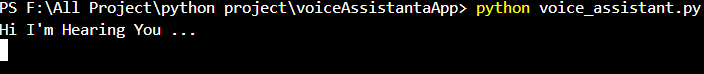
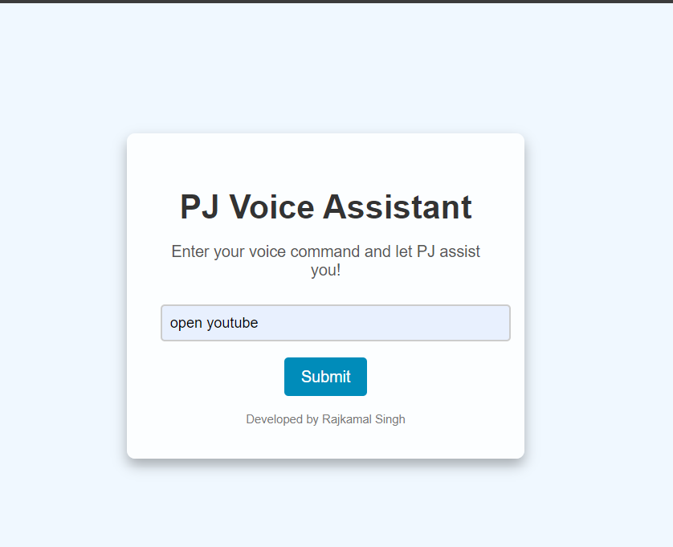

# PJ_voice_assistant

This is a simple Python voice assistant that can recognize your voice commands and respond accordingly using text-to-speech.

## Features
- Listens to your voice commands.
- Responds with speech using text-to-speech.
- Basic commands like "hello" and "exit".

## Requirements
Make sure you have the following installed:
- Python 3.x
- VS Code (or any code editor)
- Required Python libraries:
  - `SpeechRecognition`
  - `pyttsx3`
  - `pyaudio`
  - if you are using (usingFask_voiceAssistant.py)
  - `flask`

## Installation

1. **Install Python**  
   Download and install the latest version of Python from the official website: [Python.org](https://www.python.org/downloads/).

2. **Install VS Code**  
   Download and install VS Code from here: [VS Code](https://code.visualstudio.com/Download).

3. **Clone or Download the Project**  
   You can clone the repository or download the project files.
   Running the Project
#### Open the project folder in VS Code.
   In the terminal, run the following command:
## 5. **Install Required Libraries**  
   Open the terminal in VS Code and run the following commands to install the necessary libraries:
 ```
   pip install SpeechRecognition
   pip install pyttsx3
   pip install pyaudio
```
### if you use flask
```
pip install flask
```

- `
   python voice_assistant.py
  `
- `
  python flask_voiceassistat.py
  `
## Usage
-Say "hello" and the assistant will greet you.
-Say "exit" to stop the assistant.
### Future Improvements
- Add more voice commands.
 Integrate additional features like opening websites, getting weather updates, or playing music.
## Output


## Output of Flask

